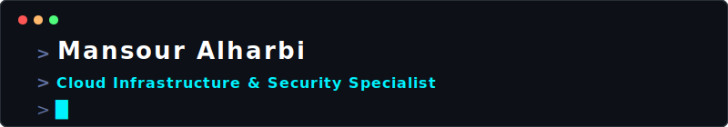
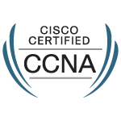

  <a href="README.md"> <b>English</b></a> &nbsp; | &nbsp; <a href="README-ar.md"> <b>العربية</b></a>

  

 

  <h3> 🐧 $ whoami | grep "Cloud & Security Specialist" </h3>
  

    Hi, I am <b>Mansour</b>, an Information Technology graduate focused on Cloud & Security.  
    I specialize in architecting resilient cloud environments, automating network operations, and enforcing strict security paradigms. Currently scaling my technical capabilities through professional certifications and hands-on engineering.
  

 

  
📫 <b>How to reach me:</b>

  &nbsp;&nbsp;&nbsp;&nbsp;&nbsp;&nbsp;&nbsp;&nbsp;&nbsp;&nbsp;&nbsp;&nbsp;

 

---

###  Technical Arsenal

  
<strong>Networking & Automation</strong>

  
  
  
  

  
<strong>Cloud & Security</strong>

  
  
  

---

###  Current Trajectory & Focus

*  **Imminent Milestone:** Finalizing preparation for the **CompTIA Security+** certification exam.
*  **Cloud Expansion:** Actively mastering **AWS Solutions Architect** principles alongside **Terraform** for Infrastructure as Code (IaC).
*  **Portfolio Development:** Deploying production-ready repositories bridging networking, security, and cloud automation.

---

 

  

 

### 📂 Featured Engineering Projects

<table width="100%">
  <tr>
    <td width="50%" valign="top">
      
      
<code>Status:</code> [████████████████████] 100%

      
<small>🎓 <b>Official Graduation Project</b></small>

    </td>
    <td width="50%" valign="top">
      
      
<code>Status:</code> [███████████████░░░░░] 75%

    </td>
    <td width="50%" valign="top">
      
      
<code>Status:</code> [██████████░░░░░░░░░░] 50%

    </td>
  </tr>
  <tr>
    <td width="50%" valign="top">
      
      
<code>Status:</code> [████░░░░░░░░░░░░░░░░] 20% (Target: July 11)

    </td>
  </tr>
</table>

---

### 📜 Certification Roadmap

<table width="100%">
  <tr>
    <td width="50%" align="center" valign="top" style="border: 1px solid #30363d; padding: 15px; border-radius: 6px; background-color: #0d1117;">
      <h4 style="color: #58a6ff; margin-bottom: 5px;">🏆 Verified Badges</h4>
      

      
        
      <strong>Cisco Certified Network Associate</strong>
    </td>
    <td width="50%" valign="top" style="border: 1px solid #30363d; padding: 15px; border-radius: 6px; background-color: #0d1117;">
      <h4 style="color: #ff3366; margin-bottom: 5px;">⚡ Active Pursuits</h4>
      

      📌 <strong>CompTIA Security+</strong>  
      <code>Status:</code> [██████████████████░░] 88% (Exam: July 4)  
      📌 <strong>AWS Solutions Architect (SAA-C03)</strong>  
      <code>Status:</code> [██████░░░░░░░░░░░░░░] 30%  
      📌 <strong>Terraform Associate</strong>  
      <code>Status:</code> [█░░░░░░░░░░░░░░░░░░░] 5%
    </td>
  </tr>
</table>
