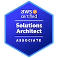

<a href="README.md"> <b>English</b></a>
&nbsp; | &nbsp;
<a href="README-ar.md"> <b>العربية</b></a>

 

<h3>$ whoami | grep "Cloud Infrastructure, Security & Network Automation" </h3>

Hi, I am <b>Mansour</b>, an Information Technology graduate and certified <b>AWS Solutions Architect – Associate</b>, <b>HashiCorp Terraform Associate (004)</b>, and <b>Cisco CCNA</b> professional focused on cloud infrastructure, Infrastructure as Code, networking, automation, and security engineering.
  
I build documented engineering projects using AWS, Terraform, Python, Linux, Cisco IOS, Docker, GitHub Actions, and OpenSearch, with an emphasis on secure architecture, reusable automation, automated validation, and operational readiness.

 

<b>How to reach me</b>

&nbsp;&nbsp;&nbsp;&nbsp;&nbsp;&nbsp;
&nbsp;&nbsp;&nbsp;&nbsp;&nbsp;&nbsp;

 

---

### Core Technical Skills

<strong>Cloud Infrastructure & Infrastructure as Code</strong>

&nbsp;
&nbsp;
&nbsp;

<strong>Networking & Automation</strong>

&nbsp;
&nbsp;
&nbsp;
&nbsp;

<strong>Infrastructure Security & Observability</strong>

&nbsp;
&nbsp;
&nbsp;
&nbsp;

---

### Technical Focus & Roadmap

- Designing secure AWS architectures with reusable Terraform modules, environment separation, private networking, and least-privilege access controls.
- Building automation and observability across cloud, Linux, and network infrastructure.
- Developing a Secure Multi-AZ AWS Application Platform with Terraform to demonstrate high availability, secure delivery, monitoring, and cost-aware operations.
- Planning an enterprise hybrid infrastructure home lab covering virtualization, Windows Server, Linux administration, Active Directory, DNS, DHCP, network segmentation, monitoring, backup, and hybrid AWS connectivity.
---

<strong>Portfolio Status:</strong>
3 completed and documented projects · 1 AWS and Terraform platform in active development

 

## Featured Technical Projects

### [Cisco IOS Network Automation Toolkit](https://github.com/MansourMutlaq/Cisco-Network-Automation)

A modular Python network automation toolkit built and validated against a live six-device Cisco IOS environment in EVE-NG. The project provides YAML-based device inventory, secure runtime credential loading, Netmiko SSH validation, timestamped running-configuration backups, Jinja2 configuration rendering, tested deployment and rollback components, structured logging, and operational reporting.

**Validated Results**

- Netmiko SSH connectivity: **6/6 devices**
- Running-configuration backups: **6/6 devices**
- Automated pytest suite: **30/30 passed**

**Technologies:** Python · Netmiko · YAML · Jinja2 · pytest · Cisco IOS · EVE-NG 
**Status:** Completed

---

### [Infrastructure Security Analytics](https://github.com/MansourMutlaq/infrastructure-security-analytics)

A multi-source infrastructure security analytics pipeline that ingests AWS CloudTrail, Linux authentication, and Cisco IOS telemetry. It normalizes heterogeneous events into an ECS-inspired security model, executes deterministic detection rules, assigns risk scores, correlates related activity, and generates investigation-ready HTML, JSON, CSV, and optional OpenSearch outputs.

**Validated Results**

- Automated test suite: **47/47 passed**
- Statement coverage: **92.98%**
- Multi-version GitHub Actions CI: **Python 3.12, 3.13, and 3.14**
- Ruff static analysis and Bandit security scanning: **Passed**
- Live OpenSearch validation: **15 normalized events and 10 correlated alerts indexed**
- AWS, Linux, and Cisco detections documented with reproducible evidence

**Technologies:** Python · AWS CloudTrail · Linux Authentication · Cisco IOS · OpenSearch · Docker Compose · GitHub Actions · pytest · Ruff · Bandit · Jinja2 
**Status:** Completed

---

### [IoT-Enabled Solar-Powered Smart Wheelchair](https://github.com/MansourMutlaq/IoT-Smart-Wheelchair)

A capstone engineering project integrating embedded software, IoT connectivity, obstacle detection, health monitoring, GPS-based location support, and solar-powered operation to improve user safety and independence. The system uses ESP32-based control, multiple sensors, real-time alerts, and energy-aware design.

**Project Contributions**

- Led the project architecture and team delivery
- Integrated embedded control, IoT communication, and sensor-based safety functions
- Implemented multi-sensor obstacle detection and alerting logic
- Documented system architecture, hardware integration, and operational behavior

**Technologies:** ESP32 · C/C++ · IoT Sensors · GPS · Embedded Systems · Solar Energy 
**Status:** Completed · Capstone Project

---

## Cloud Infrastructure Project in Development

### [Secure Multi-AZ AWS Application Platform with Terraform](https://github.com/MansourMutlaq/aws-secure-multi-az-platform)

A production-oriented AWS reference platform designed to demonstrate secure cloud infrastructure, reusable Infrastructure as Code, high availability, observability, federated CI/CD, and cost-aware operations.

The application layer remains intentionally lightweight so the project can focus on infrastructure architecture, security controls, automated delivery, validation, and operational readiness.

**Target Architecture**

- Multi-AZ VPC with public, private application, and isolated database subnets
- Application Load Balancer distributing traffic to private ECS Fargate tasks
- Amazon RDS PostgreSQL deployed without public access
- Amazon ECR and Docker-based application packaging
- Secrets Manager and AWS KMS for secrets and encryption controls
- AWS WAF protecting the public application entry point
- CloudWatch monitoring, SNS notifications, and VPC Flow Logs
- Encrypted S3 Terraform state with versioning and native state locking
- Reusable Terraform modules with separate development and production configurations

**Technical & Operational Controls**

- GitHub Actions authentication to AWS through OIDC and temporary credentials
- Separate Terraform plan and controlled apply workflows
- Terraform formatting, validation, TFLint, and Checkov scanning in CI
- Least-privilege IAM roles and security-group chaining between ALB, ECS, and RDS
- AWS Budgets, deployment evidence, failure testing, and documented teardown

**Planned Technologies:** AWS VPC · Terraform · ECS Fargate · Application Load Balancer · Amazon RDS PostgreSQL · Amazon ECR · Docker · IAM · AWS KMS · Secrets Manager · AWS WAF · CloudWatch · SNS · VPC Flow Logs · S3 Remote State · GitHub Actions OIDC · TFLint · Checkov 
**Status:** In Development 
**Started:** July 2026 
**Target Window:** Early August 2026

---

### Verified Professional Certifications

<table width="100%">
<tr>
<td width="33%" align="center" valign="top">
<h4>AWS Certified</h4>

  
<strong>AWS Certified Solutions Architect – Associate</strong>
  
<a href="https://www.credly.com/badges/dc16e4e2-440d-4ae5-a1af-97329eef6867/public_url" target="_blank">Verify Credential</a>
</td>
<td width="33%" align="center" valign="top">
<h4>HashiCorp Certified</h4>

  
<strong>HashiCorp Certified: Terraform Associate (004)</strong>
</td>
<td width="33%" align="center" valign="top">
<h4>Cisco Certified</h4>

  
<strong>Cisco Certified Network Associate</strong>
  
<a href="https://www.credly.com/badges/926aefcd-e73c-46cc-99fd-5a865908ab21/public_url" target="_blank">Verify Credential</a>
</td>
</tr>
</table>
