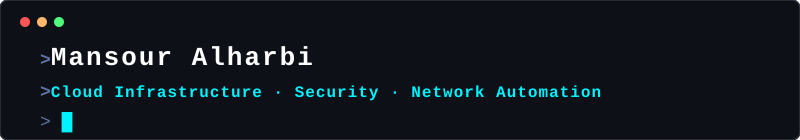
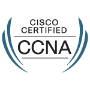

<a href="README.md"> <b>English</b></a>
&nbsp; | &nbsp;
<a href="README-ar.md"> <b>العربية</b></a>

 

<h3>$ whoami | grep "Cloud Infrastructure & Network Automation" </h3>

Hi, I am <b>Mansour</b>, an Information Technology graduate and CCNA-certified professional focused on cloud infrastructure, networking, and automation.
  
I am developing practical skills through network automation, security log analysis, AWS architecture, and Infrastructure as Code with Terraform.

 

<b>How to reach me</b>

&nbsp;&nbsp;&nbsp;&nbsp;&nbsp;&nbsp;
&nbsp;&nbsp;&nbsp;&nbsp;&nbsp;&nbsp;

 

---

### Core Technical Skills

<strong>Networking & Automation</strong>

&nbsp;
&nbsp;
&nbsp;

<strong>Cloud Infrastructure</strong>

&nbsp;

---

### Current Focus

- Preparing for the **AWS Certified Solutions Architect – Associate** certification.
- Developing practical **Terraform** skills for Infrastructure as Code.
- Publishing documented projects covering networking, security analysis, and cloud infrastructure.

---

 

 

### Featured Engineering Projects

#### [Cisco Network Automation](https://github.com/MansourMutlaq/Cisco-Network-Automation)

Python-based automation toolkit for managing Cisco IOS devices, including inventory processing, configuration backups, command execution, templated configuration deployment, logging, and reporting.

**Technologies:** Python · Netmiko · Paramiko · YAML · Cisco IOS  
**Status:** Completed

---

#### [AWS Secure VPC with Terraform](https://github.com/MansourMutlaq/AWS-Terraform-Secure-VPC)

Infrastructure as Code project for provisioning a secure AWS network environment with public and private subnets, controlled routing, and reusable Terraform configurations.

**Technologies:** AWS VPC · Terraform · Subnets · Route Tables · Security Groups  
**Status:** In Development

---

#### [Automated Security Log Analyzer](https://github.com/MansourMutlaq/Security-Log-Analyzer)

Python-based security tool for parsing system logs, identifying suspicious authentication patterns, and generating structured findings for further investigation.

**Technologies:** Python · Regular Expressions · Log Parsing · Threat Detection  
**Status:** In Development

---

#### [IoT-Enabled Solar-Powered Smart Wheelchair](https://github.com/MansourMutlaq/IoT-Smart-Wheelchair)

Capstone project integrating embedded software, IoT connectivity, obstacle detection, health monitoring, and solar-powered operation to improve user safety and independence.

**Technologies:** ESP32 · C/C++ · IoT Sensors · Embedded Systems  
**Status:** Completed · Capstone Project

---

### Certification Roadmap

<table width="100%">
<tr>
<td width="50%" align="center" valign="top"><h4>Verified Certification</h4>
  <strong>Cisco Certified Network Associate</strong>  <a href="https://www.credly.com/badges/926aefcd-e73c-46cc-99fd-5a865908ab21/public_url" target="_blank">Verify Credential</a></td>
<td width="50%" align="center" valign="top"><h4>Active Pursuits</h4>
<strong>AWS Certified Solutions Architect – Associate</strong>  <strong>HashiCorp Certified: Terraform Associate</strong></td>
</tr>
</table>
